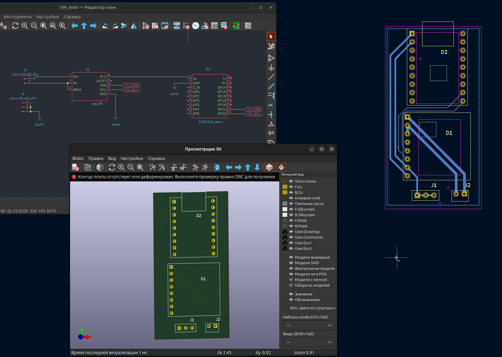
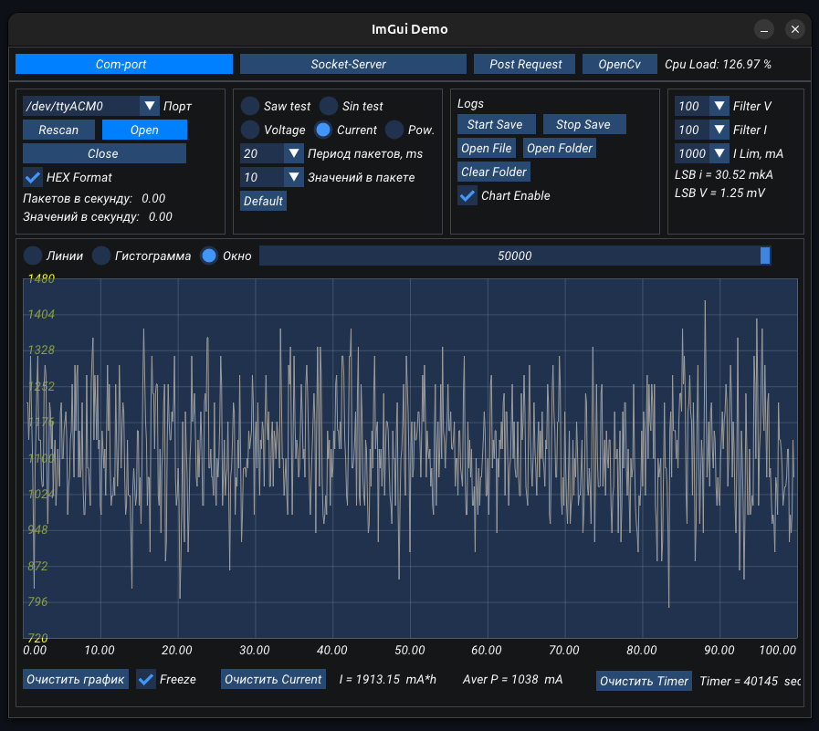

# Тестирование работы в Kicad 

Плата монитора питания на базе ESP32 и ina226

[Код esp32c6] https://github.com/bauman-robotics/esp32c3_http

[Графический интерфейс для связи с esp] https://github.com/bauman-robotics/ImGui_OpenCv

Плата нарисована в рамках изучения работы системы проектирования печатных плат Kicad за один вечер, без проработки деталей. На плате питание ina226 от +5V это требует демонтажа резисторов, подтягивающих i2c линии к питанию, т.к. сигналы для микроконтроллера должны быть не более 3.3v.
Также используется программная подтяжка i2c на микроконтроллере, что является не надежным вариантом. 
 
## Картинки

## ToDo:
Перенести питание ina226 на 3.3V или дорисовать подтягивающие резисторы для сигналов i2c.
Выровнять крепежные отверстия. 
